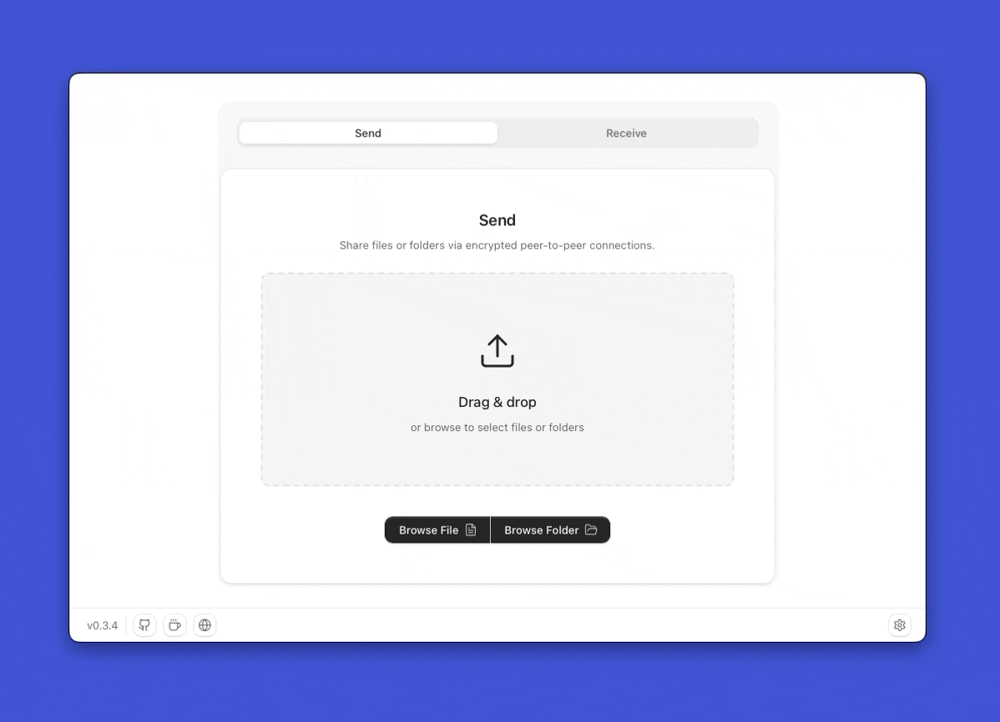

<div align="center">

# File transfer doesn't need to be complicated

</div>


<div align="center">



</div>

<div align="center">

![Version][badge-version]
![Website][badge-website]
![Platforms][badge-platforms]
[![Sponsor][badge-sponsor]](https://github.com/sponsors/tonyantony300)


</div>


A free and open-source file transfer tool that harnesses the power of [cutting-edge peer-to-peer networking](https://www.iroh.computer), letting you transfer files directly without storing them on cloud servers.

Why rely on WeTransfer, Dropbox, or Google Drive when you can reliably and easily transfer files directly, end-to-end encrypted and without revealing any personal information?

[Drop your Email for receiving major project updates 📫](https://tally.so/r/ob2Vkx)

## Features

- **Send anywhere** – Works seamlessly on local networks or across continents.
- **Peer-to-peer direct transfer** – Send files straight between devices, with no cloud storage in between.
- **End-to-end encryption** – Always-on protection with QUIC + TLS 1.3 for forward and backward secrecy.
- **No accounts or personal info** – Transfer files without sign-ups or exposing personal info.
- [**Transfer anything**](https://www.iroh.computer/proto/iroh-blobs) – Send files or directories of any size or any format, verified with BLAKE3-based integrity checks.
- **Resumable transfers** – Interrupted downloads automatically resume where they left off.
- **Fast & reliable** – Capable of saturating multi-gigabit connections for lightning-fast transfers.
- [**NAT traversal via QUIC**](https://www.iroh.computer/docs/faq#does-iroh-use-relay-servers) – Secure, low-latency connections using QUIC hole punching with encrypted relay fallback.
- **CLI integration** – Interoperable with the [Sendme CLI](https://www.iroh.computer/sendme).
- **Mobile & web** – Coming soon.
- **Free & open source** – No upload costs, no size limits, and fully community-driven.


## Installation

The easiest way to get started is by downloading one of the following versions for your respective operating system:

<table>
  <tr>
    <td><b>Platform</b></td>
    <td><b>Download</b></td>
  </tr>
  <tr>
    <td><b>Windows</b></td>
    <td><a href='https://github.com/tonyantony300/alt-sendme/releases/download/v0.3.2/AltSendme_0.3.2_x64-setup.exe'>AltSendme.exe</a></td>
  </tr>
  <tr>
    <td><b>macOS</b></td>
    <td><a href='https://github.com/tonyantony300/alt-sendme/releases/download/v0.3.2/AltSendme_0.3.2_universal.dmg'>AltSendme.dmg</a></td>
  <tr>
    <td><b>Linux </b></td>
    <td><a href='https://github.com/tonyantony300/alt-sendme/releases/download/v0.3.2/AltSendme_0.3.2_amd64.deb'>AltSendme.deb</a></td>
  </tr>
</table>


More download options in [GitHub Releases](https://github.com/tonyantony300/alt-sendme/releases).


## How it works 

1. Drop your file or folder - AltSendme creates a one-time share code (called a "ticket").
2.  Share the ticket via chat, email, or text.
3. Your friend pastes the ticket in their app, and the transfer begins.


## Under the hood ⚙️🛠️

AltSendme uses [Iroh](https://www.iroh.computer) under the hood to enable peer-to-peer file transfer. It is a modern modular alternative to technologies like WebRTC and libp2p.

### Important concepts 

- *Blobs*
- *Tickets*
- *Peer Discovery*, *Hole-punching* & *NAT traversal*
- *QUIC* & *End-to-end encryption*
- *Relays*


### 1. Blobs

Content-addressed blob storage and transfer. `iroh-blobs` implements request/response and streaming transfers of arbitrary-sized byte blobs, using BLAKE3-verified streams and content-addressed links.

- Blob: an opaque sequence of bytes (no embedded metadata).
- Link: a 32-byte BLAKE3 hash that identifies a blob.
- HashSeq: a blob that contains a sequence of links (useful for chunking/trees).
- Provider / Requester: provider serves data; requester fetches it. An endpoint can be both.

### 2. Tickets

Tickets are a way to share dialing information between iroh endpoints. They're a single token that contains everything needed to connect to another endpoint, or to fetch a blob in this case. Contains Ed25519 NodeIds: Your device's cryptographic identity for authentication.They're also very powerful. It's worth pointing out this setup is considerably better than full peer-2-peer systems, which broadcast your IP to peers. Instead in iroh, tickets are used to form a "cozy network" between peers you explicitly want to connect with. It's possible to go "full p2p" & configure your app to broadcast dialing details, but tickets represent a better middle-ground default.


### 3. Peer Discovery, NAT Traversal & Hole Punching

Peers register with an open-source public relay servers at startup to help traverse firewalls and NATs, enabling connection setup. Once connected, Iroh uses QUIC hole punching to try and establish a direct peer-to-peer connection, bypassing the relay. If direct connection is possible, communication happens directly between peers with end-to-end encryption; otherwise, the relay operates only temporarily as a fallback. This enables smooth reliable connections between peers within local-network and across the internet.

###  4. QUIC & Encryption

QUIC is a modern transport protocol built on UDP, designed to reduce latency and improve web performance over TCP. Developed originally by Google and now standardized by the IETF as HTTP/3's foundation, it integrates TLS 1.3 encryption directly into the protocol.

QUIC allows following super-powers:
* encryption & authentication
* stream multiplexing
    * no head-of-line blocking issues
    * stream priorities
    * one shared congestion controller
* an encrypted, unreliable datagram transport
* zero round trip time connection establishment if you've connected to another endpoint before


### 5. Relays

AltSendme uses open-source public relay servers to support establishing direct connections, to speed up initial connection times, and to provide a fallback should direct connections between two endpoints fail or be impossible otherwise. All connections are end-to-end encrypted. The relay is “just another UDP socket” for sending encrypted packets around. [Read more.](https://docs.iroh.computer/about/faq)


## Roadmap 🚧

- Better support for Linux distros, Windows and mac.
- Mobile versions
- Faster transfers
- Easier transfers
- Better insights into transfer process and system/network info
- Advanced user interface for power users and simple functional UI for those who just want to share stuff.
- Features for those who needs better privacy
- Features for those who wants speed and convenience


## Contributing & Community ❤️

We’d love to meet you! Before diving into code or opening a PR, join our [Discord](https://discord.gg/xwb7z22Eve) to hang out, ask questions, and discuss ideas.

It’s the best place to get context, align on direction, and collaborate with the community.


## Supported Languages
 🇺🇸 🇷🇺 🇷🇸 🇫🇷 🇨🇳 🇹🇼 🇩🇪 🇯🇵 🇹🇭 🇮🇹 🇨🇿 🇪🇸 🇧🇷 🇸🇦 🇮🇷 🇰🇷 🇮🇳 🇵🇱 🇺🇦 🇹🇷 🇳🇴 🇧🇩

## Troubleshooting

### 1. AltSendme Won't Launch on Windows (Missing Edge WebView2 Runtime)

#### Symptom

- When you double-click `AltSendme.exe`, nothing happens. No window appears, and Task Manager does not show the process.
- This can affect both the standard installer and the portable version.

#### Cause

- Microsoft Edge WebView2 Runtime is either missing, outdated, or improperly installed on your system.  
  AltSendme depends on WebView2 to render the interface on Windows.

#### How to Fix

1. **Check if WebView2 is installed**
   - Open **Add or Remove Programs** (a.k.a. *Apps & features*) on Windows.
   - Look for **Microsoft Edge WebView2 Runtime**.

2. **Install or Update WebView2**
   - Download the WebView2 Runtime directly from Microsoft: [link](https://developer.microsoft.com/en-us/microsoft-edge/webview2?form=MA13LH).
   - If you prefer an offline installer, download the offline package and run it as an Administrator.

3. **Re-run AltSendme**
   - After installing/updating WebView2, launch `AltSendme.exe` again.
   - If you still encounter problems, reboot your PC and try again.

#### Additional Tips

- If reinstalling once doesn’t work, uninstall Edge WebView2 completely, then reinstall it with Administrator privileges.
- Verify your Windows installation has the latest updates from Microsoft.

#### Still Stuck?

- Head over to our [Discord](https://discord.gg/xwb7z22Eve) server and open a support discussion with detailed logs of your environment and the steps you’ve taken.


## Development Setup

### Prerequisites

- Rust 1.81+
- Node.js 18+
- npm or yarn

### Getting Started

1. **Fork and clone the repository**:
   ```bash
   git clone https://github.com/your-username/alt-sendme.git
   cd alt-sendme
   ```

2. **Install frontend dependencies**:
   ```bash
   npm install
   ```

3. **Run in development mode**:
   ```bash
   npm run app:dev
   ```

4. **Build for production** (optional):
   ```bash
   npm run app:build -- --no-bundle
   ```


## License

AGPL-3.0

## Privacy Policy

See [PRIVACY.md](PRIVACY.md) for information about how AltSendme handles your data and privacy.

[](https://github.com/sponsors/tonyantony300) [](https://buymeacoffee.com/tny_antny)


## Contributors

<a href="https://github.com/tonyantony300/alt-sendme/graphs/contributors">
  
</a>


## Acknowledgements


- [Iroh](https://www.iroh.computer)
- [Tauri](https://v2.tauri.app)


## Contact

Reach me [here](https://www.altsendme.com/en/contact) for suggestions, feedback or media related communication.


Thank you for checking out this project! If you find it useful, consider giving it a star and helping spread the word.


<!-- <div align="center" style="color: gray;"></div> -->

[badge-website]: https://img.shields.io/badge/website-altsendme.com-orange
[badge-version]: https://img.shields.io/badge/version-0.3.2-blue
[badge-platforms]: https://img.shields.io/badge/platforms-macOS%2C%20Windows%2C%20Linux%2C%20-green
[badge-sponsor]: https://img.shields.io/badge/sponsor-ff69b4


