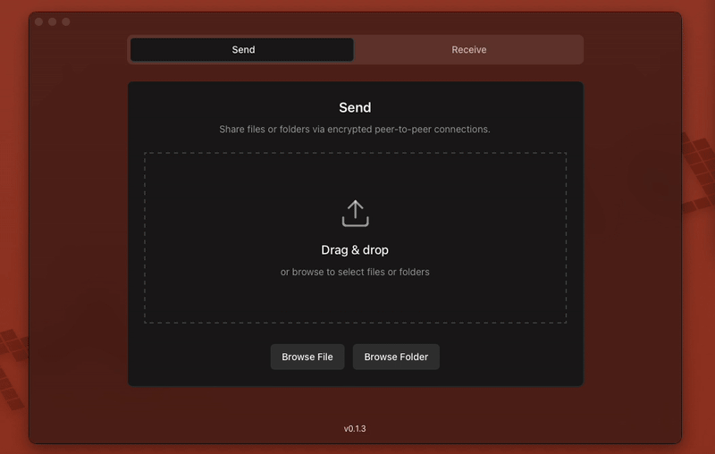

# AltSendme -  Send files anywhere, On-premises or world-wide. Frictionless, Fast, Private, Unlimited and Free



[](https://github.com/sponsors/tonyantony300)

AltSendme is frictionless peer-to-peer file transfer cross-platform desktop application using [iroh](https://crates.io/crates/iroh) to send files and
directories over the internet.


**No account requirements**, direct transfer between sender and receiver.

**All traffic** between endpoints is **end-to-end encrypted**, using QUIC + TLS 1.3. 

**Unlimited**, Fast, Free and Open-source.

Share files with **full control** and **privacy**.

optionally **interoperable** with [Sendme](https://www.iroh.computer/sendme) CLI tool


[How it connects remote devices](https://www.iroh.computer/docs/faq)

## Installation

The easiest way to get started is by downloading one of the following versions for your respective operating system:

<table>
  <tr>
    <td><b>Platform</b></td>
    <td><b>Download</b></td>
  </tr>
  <tr>
    <td><b>Windows</b></td>
    <td><a href='https://github.com/tonyantony300/alt-sendme/releases/download/v0.1.4/AltSendme_0.1.4_x64-setup_windows.exe'>AltSendme.exe</a></td>
  </tr>
  <tr>
    <td><b>macOS*</b></td>
    <td><a href='https://github.com/tonyantony300/alt-sendme/releases/download/v0.1.4/AltSendme_0.1.4_aarch64_darwin.dmg'>AltSendme.dmg</a></td>
  </tr>
  <tr>
    <td><b>Linux (deb)</b></td>
    <td><a href='https://github.com/tonyantony300/alt-sendme/releases/download/v0.1.4/AltSendme_0.1.4_amd64_linux.deb'>AltSendme.deb</a></td>
  </tr>
  <tr>
    <td><b>Linux (AppImage)</b></td>
    <td><a href='https://github.com/tonyantony300/alt-sendme/releases/download/v0.1.4/AltSendme_0.1.4_amd64_linux.AppImage'>AltSendme.AppImage</a></td>
  </tr>
</table>


*For running on macOS, see [macOS Installation (Unsigned App)](#macos-installation) below.


More download options in [GitHub Releases](https://github.com/tonyantony300/alt-sendme/releases).

## Features

- **NAT Hole Punching**: Iroh handles NAT traversal automatically, falling back to a relay if needed
- **Verified Streaming**: Blake3-verified streaming ensures data integrity
- **Resumable Downloads**: Interrupted downloads can be resumed seamlessly
- **Cross-Platform**: Native desktop application for Windows, macOS, and Linux
- **Modern UI**: React-based interface built with modern web technologies
- **Secure**: 256-bit node IDs with TLS encryption
- **CLI Compatible**: Works seamlessly with the [sendme](https://www.iroh.computer/sendme) CLI tool 


### macOS Installation 

Alt-Sendme is currently distributed **without code signing**. When you first open it, macOS will show a security warning saying the application is damaged. Here is how you can run it:


**Remove Quarantine Flag (Terminal)**

1. Open Spotlight Search (⌘+space) - search for terminal and open
2. Paste the following command and hit enter

```bash
cd /Applications && xattr -dr com.apple.quarantine AltSendme.app
```

The app is open source and safe - the warning is just macOS's gatekeeper for unsigned applications. Code signing will be added in future releases.


## Usage

### Sending Files

1. Click on the "Send Files" tab
2. Either:
   - Drag and drop a file/folder onto the drop zone
   - Click "Select File" or "Select Folder" to browse
3. Click "Start Sharing"
4. Copy the generated ticket and share it with others
5. Keep the app open while others download your files

### Receiving Files

1. Click on the "Receive Files" tab
2. Paste the ticket you received from someone
3. Click "Receive File"
4. Files will be saved to folder of your choice

All connections are encrypted and verified using blake3 hashing. The application handles NAT traversal automatically and will use relay servers as a fallback when direct connections aren't possible.

## CLI Compatibility

The desktop version uses the same core networking library as the CLI version, so:
- Tickets generated by CLI can be used in desktop
- Tickets generated by desktop can be used in CLI
- Both versions can send/receive to each other


## Development

If you want to contribute or run the app from source:

### Prerequisites

- Rust 1.81+
- Node.js 18+
- npm or yarn

### Running in Development

1. **Install frontend dependencies**:
   ```bash
   cd web-app
   npm install
   ```

2. **Run the desktop app**:
   ```bash
   cd src-tauri
   cargo tauri dev
   ```

This will start the app with hot reload enabled for both frontend and backend changes.


## Architecture

- **Backend**: Rust with Tauri framework
- **Frontend**: React + TypeScript + Tailwind CSS
- **Core Logic**: Shared library between CLI and desktop versions
- **File System**: Uses Tauri's secure file system APIs
- **Networking**: Same Iroh P2P networking as CLI version

## Troubleshooting

- **App won't start**: Make sure you have Rust and Node.js installed
- **File selection doesn't work**: Check that the app has file system permissions
- **Network issues**: Same troubleshooting as CLI version (firewall, NAT, etc.)
- **Build errors**: Try `cargo clean` and rebuild

## License

AGPL-3.0

[](https://github.com/sponsors/tonyantony300)

# Acknowledgements

Built on the shoulders of giants:

- [Iroh](https://www.iroh.computer)
- [Tauri](https://v2.tauri.app)
