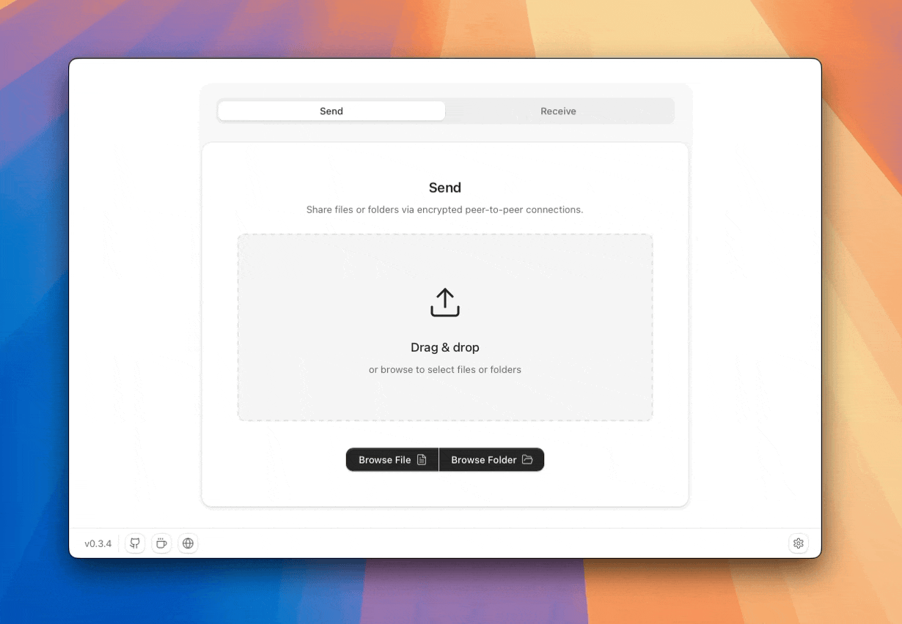

**Idioma:** [English](../../README.md) | [中文](README.zh-CN.md) | [Русский](README.ru.md) | [Português](README.pt-BR.md) | Español | [Deutsch](README.de.md) | [Français](README.fr.md) | [日本語](README.ja.md) | [한국어](README.ko.md) | [Polski](README.pl.md) | [العربية](README.ar.md)

# Transferir archivos no tiene por qué ser complicado

[![Discord][badge-discord]](https://discord.gg/xwb7z22Eve)
[![Version][badge-version]](https://github.com/tonyantony300/dashbeam/releases/latest)
![Website][badge-website]
![Platforms][badge-platforms]
[![Sponsor][badge-sponsor]](https://github.com/sponsors/tonyantony300)

Una herramienta gratuita y de código abierto para transferir archivos que aprovecha el poder de las [redes peer-to-peer de vanguardia](https://www.iroh.computer), permitiéndote transferir archivos directamente sin almacenarlos en servidores en la nube.

¿Por qué depender de WeTransfer, Dropbox o Google Drive cuando puedes transferir archivos de forma confiable y sencilla, directamente, con cifrado de extremo a extremo y sin revelar información personal?

## Características

- **Envía a cualquier lugar, desde cualquier dispositivo** — Escritorio, Android, terminal o navegador: inicia en una plataforma y recibe en cualquier otra.
- **Transfiere cualquier cosa, de cualquier tamaño** — Archivos o carpetas completas, verificados de extremo a extremo con comprobaciones de integridad BLAKE3.
- **Lo suficientemente rápido para marcar la diferencia** — Satura conexiones multigigabit para transferencias ultrarrápidas.
- **Privado por defecto** — Sin cuentas, sin registros, sin rastreo, sin anuncios.
- **Transferencia directa de dispositivo a dispositivo** — Los archivos se mueven directamente entre tus dispositivos, sin pasar por el almacenamiento en la nube corporativo donde tus datos son la moneda de cambio.
- **Cifrado de extremo a extremo, siempre activo** — Cada transferencia usa QUIC con TLS 1.3; los relays solo ven tráfico cifrado, incluso si intervienen.
- **Autenticación criptográfica** — Cada ticket verifica que estás conectado al remitente correcto antes de transferir cualquier archivo.
- **Reanudable y difusible** — Las transferencias interrumpidas se reanudan automáticamente; comparte el mismo archivo con cualquier cantidad de pares a la vez.
- **Vista previa antes de descargar** — Mira lo que recibes antes de descargarlo.
- **Dispositivos emparejados** — Empareja computadoras y teléfonos Android una vez en **Configuración → Dispositivos**, y luego envía archivos sin copiar tickets cada vez.
- **Ultraligero** — Instalaciones mínimas, huella web reducida.
- **Gratuito y de código abierto** — Sin costos de subida, sin límites de tamaño, impulsado por la comunidad.

## Estadísticas reales

| Métrica | Reportado |
|--------|--------|
| **Transferencia más grande** | 452 GB |
| **Transferencia grande más rápida** | 54 GB @ 123 MB/s (~1 Gbps) |
| **Transferencia masiva de alta velocidad** | 328 GB @ 93 MB/s |
| **Velocidad máxima medida** | 125 MB/s (1 Gbps) |

*El rendimiento de la transferencia depende de tu dispositivo, red y ruta de conexión.*

## Instalación

La forma más sencilla de comenzar es descargar una de las siguientes versiones para tu sistema operativo:

<table>
  <tr>
    <td><b>Plataforma</b></td>
    <td><b>Recomendado</b></td>
    <td><b>Otros formatos</b></td>
    <td><b>Tamaño</b></td>
  </tr>
  <tr>
    <td>💻 <b>Windows (x64)</b></td>
    <td><a href='https://github.com/tonyantony300/dashbeam/releases/download/v0.6.0/AltSendme_0.6.0_x64-setup.exe'>Setup.exe</a></td>
    <td><a href='https://github.com/tonyantony300/dashbeam/releases/download/v0.6.0/AltSendme_0.6.0_x64_en-US.msi'>MSI</a>, <a href='https://github.com/tonyantony300/dashbeam/releases/download/v0.6.0/AltSendme_0.6.0_x64-portable.zip'>Portable ZIP</a></td>
    <td>~10 MB</td>
  </tr>
  <tr>
    <td>💻 <b>macOS (Universal)</b></td>
    <td><a href='https://github.com/tonyantony300/dashbeam/releases/download/v0.6.0/AltSendme_0.6.0_universal.dmg'>DashBeam.dmg</a></td>
    <td><a href='https://github.com/tonyantony300/dashbeam/releases/download/v0.6.0/AltSendme_0.6.0_aarch64.dmg'>Apple Silicon</a>, <a href='https://github.com/tonyantony300/dashbeam/releases/download/v0.6.0/AltSendme_0.6.0_x64.dmg'>Intel</a></td>
    <td>~15 MB</td>
  </tr>
  <tr>
    <td>💻 <b>Linux (amd64)</b></td>
    <td><a href='https://github.com/tonyantony300/dashbeam/releases/download/v0.6.0/AltSendme_0.6.0_amd64.deb'>DashBeam.deb</a></td>
    <td><a href='https://github.com/tonyantony300/dashbeam/releases/download/v0.6.0/AltSendme-0.6.0-1.x86_64.rpm'>.rpm</a>, <a href='https://github.com/tonyantony300/dashbeam/releases/download/v0.6.0/AltSendme_0.6.0_amd64.AppImage'>AppImage</a></td>
    <td>~13 MB</td>
  </tr>
  <tr>
    <td>📱 <b>Android (arm64)</b></td>
    <td><a href='https://github.com/tonyantony300/dashbeam/releases/download/v0.6.0/AltSendme-v0.6.0-arm64.apk'>DashBeam.apk</a></td>
    <td><a href='https://github.com/tonyantony300/dashbeam/releases/download/v0.6.0/AltSendme-v0.6.0-armv7.apk'>armv7</a>, <a href='https://github.com/tonyantony300/dashbeam/releases/download/v0.6.0/AltSendme-v0.6.0-universal.apk'>universal</a></td>
    <td>~50 MB</td>
  </tr>
  <tr>
    <td>⌨️ <b>CLI</b></td>
    <td><a href='https://www.dashbeam.net/en/downloads'>Downloads</a></td>
    <td>-</td>
    <td>~4-5 MB</td>
  </tr>
  <tr>
    <td>🌐 <b>Web (rendimiento limitado)</b></td>
    <td><a href='https://app.dashbeam.net'>app.dashbeam.net</a></td>
    <td>-</td>
    <td>~2 MB</td>
  </tr>
</table>

Más opciones en [GitHub Releases](https://github.com/tonyantony300/dashbeam/releases) o en la página de [Downloads](https://www.dashbeam.net/en/downloads).

## Socios

<a href="https://www.testmuai.com" rel="nofollow">
  <picture>
    <source media="(prefers-color-scheme: dark)" srcset="https://www.dashbeam.net/assets/sponsors/testmu-light.svg">
    <source media="(prefers-color-scheme: light)" srcset="https://www.dashbeam.net/assets/sponsors/testmu-dark.svg">
    
  </picture>
</a>

¡Buscamos socios para unirse a nuestra misión! Asóciate con nosotros y apóyanos mientras ampliamos los límites de la transferencia de archivos peer-to-peer.

[**HABLEMOS**](https://www.dashbeam.net/en/contact)

## Idiomas compatibles
 🇺🇸 🇷🇺 🇫🇷 🇨🇳 🇩🇪 🇯🇵 🇮🇳 🇹🇭 🇮🇹 🇨🇿 🇪🇸 🇧🇷 🇸🇦 🇮🇷 🇰🇷  🇵🇱 🇺🇦 🇹🇷 🇳🇴 🇧🇩 🇭🇺 🇷🇸 🇹🇼 🇰🇭

 
## Cómo funciona

1. Suelta tu archivo o carpeta: DashBeam crea un código de uso único para compartir (llamado «ticket»).
2. Comparte el ticket por chat, correo electrónico o mensaje de texto, **o** envíalo directamente a un dispositivo emparejado (escritorio / Android).
3. Tu contacto pega el ticket en su app (o acepta una invitación de un dispositivo emparejado) y comienza la transferencia.

### Dispositivos emparejados

En macOS, Windows, Linux y Android puedes emparejar dispositivos en **Configuración → Dispositivos** usando un código de emparejamiento. Después del emparejamiento:

- Los remitentes pueden tocar **Enviar** junto a un dispositivo emparejado mientras comparten: sin copiar el ticket manualmente.
- Los receptores reciben un aviso en la app cuando un remitente emparejado los invita (la app debe estar abierta).
- Los tickets manuales y el [sendme CLI](https://www.iroh.computer/sendme) siguen funcionando exactamente igual que antes.

## Comparación

| | **DashBeam** | **Blip** | **LocalSend** | **Magic Wormhole** | **PairDrop** |
|:---|:---:|:---:|:---:|:---:|:---:|
| Stack de red | QUIC via Iroh | Desconocido | HTTPS/REST sobre TCP | TCP cifrado | WebRTC/DTLS (SCTP) |
| Funciona en Internet | ✅ | ✅ | Solo LAN | ✅ | ✅ |
| Satura conexiones gigabit | ✅ | ✅ | ✅ (solo LAN) | ✅ | ❌ (límite SCTP/navegador) |
| Código abierto | ✅ | ❌ | ✅ | ✅ | ✅ |
| No requiere cuenta | ✅ | ❌ | ✅ | ✅ | ✅ |
| Cifrado de extremo a extremo | ✅ | ✅ | ✅ | ✅ | ✅ |
| Enviar carpetas | ✅ | ✅ | ✅ | ✅ | ✅ (solo CLI, no en navegador) |
| Transferencias reanudables | ✅ | ✅ | ❌ | ❌ | ❌ |
| Tamaño de archivo ilimitado | ✅ | ✅ | ✅ | ✅ | Limitado por la memoria del navegador |
| Plataformas | CLI + escritorio + móvil + web | Escritorio + móvil (sin web/CLI) | Escritorio + móvil (sin web/CLI) | Solo CLI | Web/PWA + app Android + CLI |
| La pega | En desarrollo | Código cerrado; el manejo de datos no puede auditarse | Solo misma red, sin reanudación | Solo CLI; las interfaces gráficas son separadas y mantenidas por la comunidad | Límite de rendimiento WebRTC/SCTP; límites de memoria del navegador |

[Saber más →](https://www.dashbeam.net/en/compare)

## Bajo el capó

DashBeam está construido sobre [Iroh](https://www.iroh.computer), un stack de red peer-to-peer moderno que simplifica la comunicación directa de dispositivo a dispositivo. En la práctica, eso significa que los dispositivos se comunican mediante QUIC cifrado, los archivos se mueven con blobs direccionados por contenido, y los relays ayudan cuando no hay una ruta directa disponible.

### Los bloques de construcción

| Pieza | Qué hace aquí |
|-------|-------------------|
| **Blobs** (`iroh-blobs`) | Almacenan y transmiten datos de archivos; cada fragmento se verifica con BLAKE3 |
| **Tickets** | Una cadena que le indica a un par *a quién* contactar y *qué* obtener |
| **Endpoints** | La identidad Iroh de cada dispositivo (clave Ed25519 → id de endpoint) |
| **QUIC + TLS 1.3** | Transporte cifrado; multiplexación sin bloqueo en la cabecera de línea |
| **Relays + hole punching** | Inician conexiones a través de NAT; prefieren la ruta directa, con fallback al relay |
| **Protocolo de control** (emparejamiento) | Canal persistente para recordar dispositivos y entregar invitaciones de compartición |

### Blobs

Los archivos no se suben a un servidor. Se publican como **blobs**: secuencias opacas de bytes direccionadas por un hash BLAKE3.

- Un **link** es ese hash de 32 bytes: si el hash coincide, el contenido coincide.
- Las carpetas y los archivos grandes usan un **HashSeq** (un blob que apunta a otros blobs).
- El remitente es el **proveedor**; el receptor es el **solicitante**. Cualquiera de los dos puede ser ambos.

### Tickets

Un **ticket** de compartición es un token único que incluye:

1. El id de endpoint del remitente (para saber que hablas con el dispositivo correcto)
2. Suficiente información de dirección / relay para contactarlo
3. El hash del blob a descargar

Solo te conectas con personas con las que compartes un ticket: no difundes tu IP a desconocidos. Ese es el modelo «cozy network» predeterminado que promueve Iroh, frente al descubrimiento masivo en todo el swarm.

### Conexión a través de redes

Cuando dos dispositivos necesitan conectarse:

1. Cada uno se registra en un **relay** público (o autohospedado) para que los pares puedan encontrar una ruta a través de firewalls y NAT.
2. Iroh intenta **hole punching QUIC** para establecer un enlace peer-to-peer directo.
3. Si funciona una ruta directa, el tráfico va de dispositivo a dispositivo. Si no, el relay permanece en la ruta como salto UDP de respaldo.

En cualquier caso, la carga útil está cifrada de extremo a extremo. Los relays ven texto cifrado, no tus archivos. [Más sobre los relays de Iroh →](https://docs.iroh.computer/about/faq)

### QUIC y cifrado

QUIC (basado en UDP, la misma base que HTTP/3) integra TLS 1.3 en el transporte. Para DashBeam, eso aporta cifrado y autenticación, múltiples flujos con control de congestión compartido, y reconexiones rápidas cuando ya has hablado con un par antes.

### Dispositivos emparejados

El emparejamiento no reemplaza los tickets; los entrega por ti.

1. Los dispositivos intercambian un **código de emparejamiento** corto (el id de endpoint del host) a través de un ALPN de control dedicado.
2. Cada lado demuestra su identidad firmando material de claves vinculado a la conexión con su secreto de dispositivo, y luego recuerda al par localmente.
3. Una conexión de control persistente mantiene la presencia (en línea/fuera de línea).
4. Cuando compartes, DashBeam sigue creando un ticket blob de uso único normal; elegir un dispositivo emparejado envía ese ticket como una **invitación** en la app en lugar de hacerte copiarlo y pegarlo.

Los tickets manuales y el [sendme CLI](https://www.iroh.computer/sendme) siguen funcionando exactamente igual que antes.

### Autohospedaje de relays y descubrimiento

Para saber cómo ejecutar tu propio relay y servidor de descubrimiento iroh, configurar DashBeam para usarlos, y cómo se comportan las configuraciones mixtas públicas/autohospedadas, consulta [`../../infra/README.md`](../../infra/README.md) (relay: [`../../infra/relay/README.md`](../../infra/relay/README.md#using-self-hosted-relays-with-dashbeam), descubrimiento: [`../../infra/dns/README.md`](../../infra/dns/README.md)).

## Desarrollo

Consulta [CONTRIBUTING.md](../../CONTRIBUTING.md#development-setup) para requisitos previos, configuración local, instrucciones de compilación y pruebas.

## Únete a nuestro [Discord](https://discord.gg/xwb7z22Eve) para contribuir

La mejor forma de contribuir es unirte a nuestro Discord y saludar. Preséntate y comparte tus habilidades o intereses, ya sea programación, pruebas, diseño u otra cosa. También puedes reportar problemas, sugerir correcciones o proponer ideas. Los mantenedores están ahí para guiarte en cada paso.

Es el mejor lugar para obtener contexto, alinearse en la dirección y colaborar con la [comunidad](https://discord.gg/xwb7z22Eve).

## Licencia

AGPL-3.0

## Política de privacidad

Consulta [PRIVACY.md](../../PRIVACY.md) para información sobre cómo DashBeam maneja tus datos y tu privacidad.

 

## Colaboradores

## Contacto

Escríbeme [aquí](https://www.dashbeam.net/en/contact) para sugerencias, comentarios o comunicación relacionada con medios.

¡Gracias por revisar este proyecto! Si te resulta útil, considera darle una estrella y ayudar a difundirlo.

## Construido con

  

<!-- 

 -->

[badge-website]: https://img.shields.io/badge/website-dashbeam.net-orange
[badge-version]: https://img.shields.io/badge/version-0.6.0-blue
[badge-discord]: https://img.shields.io/badge/Discord-join-5865F2?logo=discord&logoColor=white
[badge-platforms]: https://img.shields.io/badge/platforms-macOS%2C%20Windows%2C%20Linux%2C%20Android%2C%20CLI%2C%20-green
[badge-sponsor]: https://img.shields.io/badge/sponsor-ff69b4

